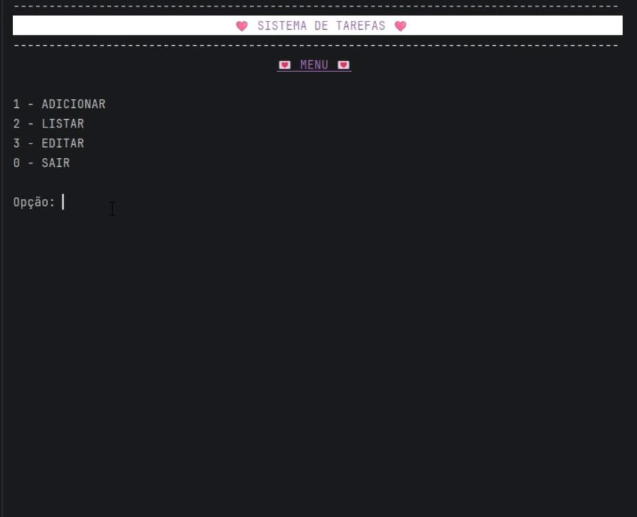
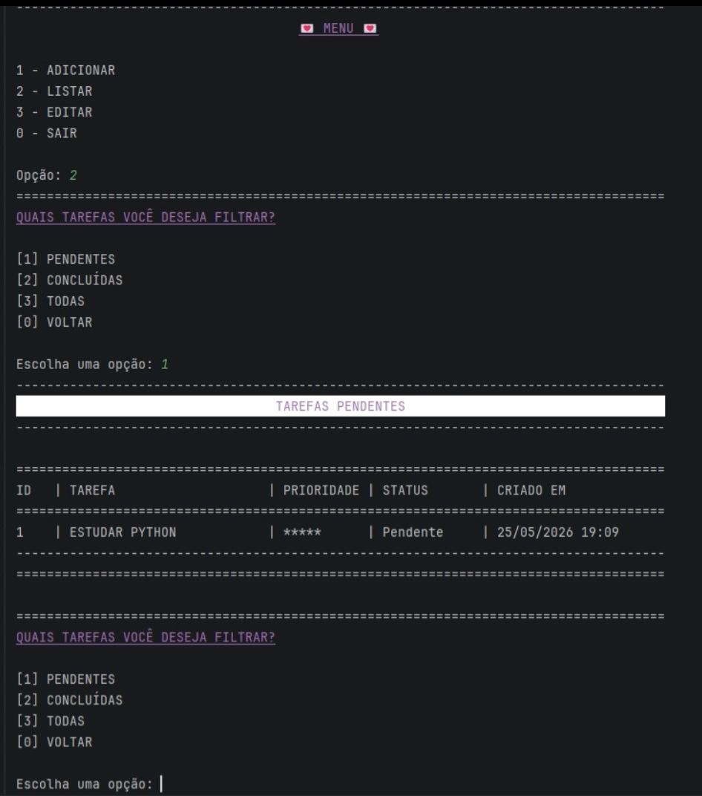

 <h1 align="center">☑️ Sistema de Gerenciamento de Tarefas em Python 📝</h1>
 
 ## Um sistema de gerenciamente de tarefas simples executado diretamente no terminal

## 📌 Funcionalidades
* Adicionar tarefas com nível de importância.
* Listar as tarefas com filtros de listagem, ou seja, o usuário pode escolher entre:
  * **Listar Tarefas Pendentes**
  * **Listar Tarefas Concluídas**
  * **Listar Todas**
* Editar as tarefas, com o usuário podendo alterar o status com essas opções:
  * **Marcar como concluída**
  * **Marcar como pendente**
* Remover tarefas

## 📌 Tecnologias usadas
* Python
* JSON

## 📌 Como executar o projeto
### Passos:
   1. **Clonar o repositório:**
```bash
   git clone [https://github.com/Lohana-Caruccio/to-do-list_Python.git]
```
  2. **Navegar até a pasta do projeto:**
```bash
  cd [to-do-list_Python]
```
  3. **Executar o script:**
```bash
  python main.py
```

## 📌 Demonstração básica do sistema

### Menu do Sistema


### Demonstração de uma das funções do Sistema

    
## 🩷 Autora
Lohana Caruccio
